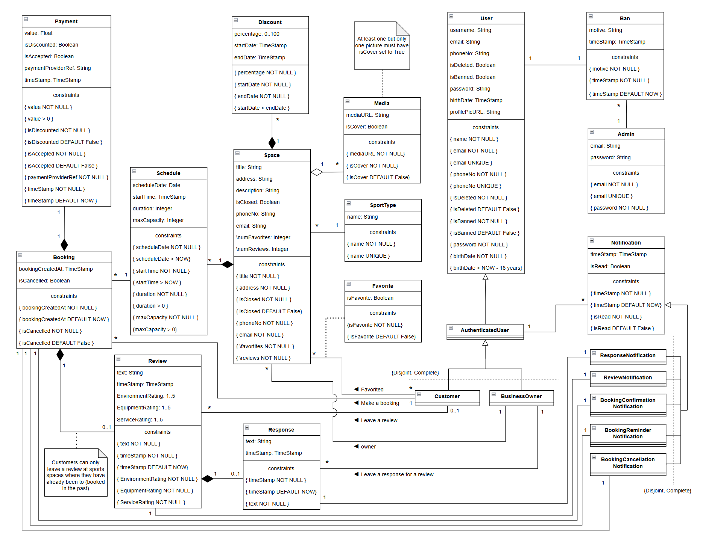

# EBD: Database Specification Component

The SportsHub system is being developed as a web-based platform that connects people who want flexible sports options with sports facilities and service providers. It bridges the gap between users who want flexibility and businesses that want to optimize their underused spaces or promote their services in a wider market.

## A4: Conceptual Data Model

The purpose of this artifact is to create a comprehensive conceptual data model that illustrates the relationships among various classes within the system. For this, we provide a class UML diagram for understanding how different entities interact, as well as a table containing the remaining business rules.

### 1. Class diagram

<div align="center">
  
  <p align="center">Figure 1: Class Diagram</p>
</div>

### 2. Additional Business Rules

| Identifier | Name                                | Description                                                                                                               |
| -----------|------------------------------------ | ------------------------------------------------------------------------------------------------------------------------- |
| BR10       | Deleted User Account                | Upon account deletion, reviews are kept but are made anonymous.                                                           |
| BR13       | Reservation schedule Constraint     | Customers cannot double-book in the same (or different) sport spaces at the same time slot.                               |       |
| BR17       | Modify Reservations                 | Customers can cancel or modify reservations only before the reservation start time.                                       |
| BR18       | Deleted Business Account            | When a Business Owner deletes its profile, their sports spaces are deleted.                                               |
| BR19       | Closed Spaces                       | When a sports space is closed, all future reservations are canceled.                                                      |
| BR20       | Permanently Closed Spaces           | When a sports space is permanently closed, all future reservations are canceled and the space's data are deleted except the spaceId, name and main image. |
| BR21       | Past or canceled reservations for closed sport spaces | When a past or canceled reservation is about a closed space, the "Repeat Reservation" option is not displayed, it is not possible to provide a review of that reservation (if it is a past reservation) and it isn't possible to click on the space to access its page or view its details. |
| BR22       | Banned User                         | If a user is blocked by an administrator, they cannot do anything: in the case of a customer, they cannot make or edit reservations or leave reviews; in the case of a company, spaces are closed (not permanently) and new spaces cannot be created or edited, nor can they respond to reviews of spaces (which are now closed). |

<div align="center">
  <p>Table 1: Additional Business Rules</p>
</div>

## A5: Relational Schema, validation and schema refinement

This artifact contains the Relational Schema obtained by mapping from the Conceptual Data Model. Besides the relational schema, this artifact also contains the validation of each relation according to functional dependencies and normal forms.

### 1. Relational Schema

The Relational Schema includes each relation schema, attributes, domains, primary keys, foreign keys and other integrity rules.

| Relation reference | Relation Compact Notation |
|-------------------|---------------------------|
| R01 | user(<ins>id</ins>, username **NN**, email **UK NN**, phone_no **UK NN**, is_deleted **NN DF** False, is_banned **NN DF** False, password **NN**, birth_date **NN CK** birth_date > NOW - 18 years, profile_pic_url) |
| R02 | business_owner(<ins>id</ins>, user_id -> user **NN**) |
| R03 | customer(<ins>id</ins>, user_id -> user **NN**) |
| R04 | space(<ins>id</ins>, owner_id -> business_owner **NN**, sport_type_id -> sport_type **NN**, title **NN**, address **NN**, description **NN**, is_closed **NN DF** False, phone_no **NN**, email **NN**, num_favorites **NN**, num_reviews **NN**) |
| R05 | admin(<ins>id</ins>, email **UK NN**, password **NN**) |
| R06 | ban(<ins>id</ins>, user_id -> user **NN**, admin_id -> admin **NN**, motive **NN**, time_stamp **NN DF** now) |
| R07 | review(<ins>id</ins>, customer_id -> customer, booking_id -> booking, text **NN**, time_stamp **NN DF** now, environment_rating **NN CK** 1 ≤ environment_rating ≤ 5, equipment_rating **NN CK** 1 ≤ equipment_rating ≤ 5, service_rating **NN CK** 1 ≤ service_rating ≤ 5) |
| R08 | booking(<ins>id</ins>, space_id -> space **NN**, customer_id -> customer **NN**, schedule_id -> schedule **NN**, booking_created_at **NN DF** now, is_cancelled **NN DF** False) |
| R09 | response(<ins>id</ins>, owner_id -> business_owner **NN**, review_id -> review **NN**, text **NN**, time_stamp **NN DF** now) |
| R10 | payment(<ins>id</ins>, booking_id -> booking **NN**, payment_value **NN CK** value > 0, is_discounted **NN DF** False, is_accepted **NN DF** False, payment_provider_ref **NN**, time_stamp **NN DF** now) |
| R11 | discount(<ins>id</ins>, space_id -> space **NN**, percentage **NN CK** 0 < percentage < 100, start_date **NN**, end_date **NN CK** start_date < end_date) |
| R12 | notification(<ins>id</ins>, user_id -> user **NN**, time_stamp **NN DF** now, is_read **NN DF** False) |
| R13 | response_notification(<ins>id</ins>, notification_id -> notification **NN**, response_id -> response **NN**) |
| R14 | review_notification(<ins>id</ins>, notification_id -> notification **NN**, review_id -> review **NN**) |
| R15 | booking_confirmation_notification(<ins>id</ins>, notification_id -> notification **NN**, booking_id -> booking **NN**) |
| R16 | booking_cancellation_notification(<ins>id</ins>, notification_id -> notification **NN**, booking_id -> booking **NN**) |
| R17 | booking_reminder_notification(<ins>id</ins>, notification_id -> notification **NN**, booking_id -> booking **NN**) |
| R18 | schedule(<ins>id</ins>, space_id -> space **NN**, start_time **NN CK** start_time > now, duration **NN CK** duration > 0, max_capacity **NN CK** max_capacity > 0) |
| R19 | media(<ins>id</ins>, <ins>space_id</ins> -> space **NN**, media_url **NN**, is_cover **NN DF** False) |
| R20 | favorited(<ins>space_id</ins> -> space **NN**, <ins>customer_id</ins> -> customer **NN**, is_favorite **NN DF** False) |
| R21 | sport_type(<ins>id</ins>, name **UK NN**) |

<div align="center">
  <p>Table 2: Relational Schema Notations</p>
</div>

> Legend:
> - UK = UNIQUE KEY
> - NN = NOT NULL
> - DF = DEFAULT
> - CK = CHECK

#### Generalization Justification

| Class | Constraints | Style Used | Justification |
|-------|-------------|------------|----------------|
| Authenticated user | Disjoint, Complete | E/R style | Even though they're both users, Customers and Business owners have several different functions. Therefore, it is beneficial to use the E/R style for them, as it will make it easier to differentiate between customer and owner ids when doing tasks such as creating spaces, leaving reviews and responses or booking a space |
| Notification | Disjoint, Complete | E/R style | Depending on what they're notifying, notifications have different foreign keys. Therefore, the E/R style is the best to represent the notifications, as it provides a strong separation between each type of notification and we predict a lot of notifications will be made, so any unnecessary foreign keys should be present in classes |

<div align="center">
  <p>Table 3: Generalization Justifications</p>
</div>

### 2. Domains


| Domain Name        | Domain Specification                                                |
|--------------------|---------------------------------------------------------------------|
| SportsType         | ENUM('Badminton', 'Basketball', 'Biking', 'Climbing', 'Football', 'Golf', 'Gym', 'Handball', 'Hockey', 'Martial Arts', 'Padel', 'Rugby', 'Running', 'Skating', 'Swimming', 'Tennis', 'Volleyball', 'Other') |
|PaymentProviders|  ENUM('Credit / Debit Card', 'MB Way', 'Paypal')|
|Notification| ENUM('ResponseNotification','ReviewNotification','BookingConfirmationNotification','BookingCancellationNotification')|


<div align="center">
  <p>Table 4: Domain Specification</p>
</div>

### 3. Schema validation


| Table R01 | User |
|---|---|
| **Keys:** | {id}, {email}, {phone_no} |
| **Functional Dependencies:** |
| FD0101 | {id} -> {user_name, email, phone_no, role, is_deleted, is_banned, password, birthday, profile_pic_url} |
| FD0102 | {email} -> {id, user_name, phone_no, role, is_deleted, is_banned, password, birthday, profile_pic_url} |
| FD0103 | {phone_no} -> {id, user_name, email, role, is_deleted, is_banned, password, birthday, profile_pic_url} |
| **Normal Form** | BCNF |

| Table R02 | Business Owner |
|---|---|
| **Keys:** | {id}, {user_id} |
| **Functional Dependencies:** |  |
|FD201:| {id} -> {user_id}|
|FD202:| {user_id} -> {id}|
| **Normal Form** | BCNF |

| Table R03 | Customer |
|---|---|
| **Keys:** | {id}, {user_id} |
| **Functional Dependencies:** |  |
|FD301:| {id} -> {user_id}|
|FD302:| {user_id} -> {id}|
| **Normal Form** | BCNF |

| Table R04 | Space |
|---|---|
| **Keys:** | {id} |
| **Functional Dependencies:** |
| FD0401 | {id} -> {title, address, description, space_pic_url, is_closed, sport_type_id -> sport_type, phone_no, email, #favorites, #reviews} |
| **Normal Form** | BCNF |

| Table R05 | Admin |
|---|---|
| **Keys:** | {id}, {email} |
| **Functional Dependencies:** |
| FD0501 | {id} -> {email, password} |
| FD0502 | {email} -> {id, password} |
| **Normal Form** | BCNF |

| Table R06 | Ban |
|---|---|
| **Keys:** | {id}, {user_id} |
| **Functional Dependencies:** |
| FD0601 | {id} -> {user_id -> user, admin_id -> admin, motive, time_stamp} |
| FD0602 | {user_id} -> {id, admin_id -> admin, motive, time_stamp} |
| **Normal Form** | BCNF |

| Table R07 | Review |
|---|---|
| **Keys:** | {id}, {booking_id} |
| **Functional Dependencies:** |
| FD0701 | {id} -> {user_id -> user, text, time_stamp, rating} |
| FD0702 | {booking_id} -> {id, user_id -> user, text, time_stamp, rating} |
| **Normal Form** | BCNF |

| Table R08 | Booking |
|---|---|
| **Keys:** | {id} |
| **Functional Dependencies:** |
| FD0801 | {id} -> {space_id -> space, user_id -> user, booking_date, time_stamp, is_cancelled} |
| **Normal Form** | BCNF |

| Table R09 | Response |
|---|---|
| **Keys:** | {id}, {review_id} |
| **Functional Dependencies:** |
| FD0901 | {id} -> {user_id -> user, review_id -> review, text, time_stamp} |
| FD0902 | {review_id} -> {id, user_id -> user, review_id -> review, text, time_stamp} |
| **Normal Form** | BCNF |

| Table R10 | Payment |
|---|---|
| **Keys:** | {id}, {booking_id} |
| **Functional Dependencies:** |
| FD1001 | {id} -> {booking_id -> booking, payment_value, is_discounted, is_accepted, payment_provider_ref, time_stamp} |
| FD1002 | {booking_id} -> {id, payment_value, is_discounted, is_accepted, payment_provider_ref, time_stamp} |
| **Normal Form** | BCNF |

| Table R11 | Discount |
|---|---|
| **Keys:** | {id} |
| **Functional Dependencies:** |
| FD1101 | {id} -> {space_id -> space, value, start_date, end_date} |
| **Normal Form** | BCNF |

| Table R12 | Notification |
|---|---|
| **Keys:** | {id} |
| **Functional Dependencies:** |
| FD1201 | {id} -> {user_id -> user, time_stamp, is_read} |
| **Normal Form** | BCNF |

| Table R13 | Response Notification |
|---|---|
| **Keys:** | {id} |
| **Functional Dependencies:** |
| FD1301 | {id} -> {user_id -> user, time_stamp, is_read, response_id -> response} |
| **Normal Form** | BCNF |

| Table R14 | Review Notification |
|---|---|
| **Keys:** | {id} |
| **Functional Dependencies:** |
| FD1402 | {id} -> {user_id -> user, time_stamp, is_read, review_id -> review} |
| **Normal Form** | BCNF |

| Table R15 | Booking Confirmation Notification |
|---|---|
| **Keys:** | {id} |
| **Functional Dependencies:** |
| FD1503 | {id} -> {user_id -> user, time_stamp, is_read, booking_id -> booking} |
| **Normal Form** | BCNF |

| Table R16 | Booking Reminder Notification |
|---|---|
| **Keys:** | {id} |
| **Functional Dependencies:** |
| FD1604 | {id} -> {user_id -> user, time_stamp, is_read, booking_id -> booking} |
| **Normal Form** | BCNF |

| Table R17 | Booking Cancellation Notification |
|---|---|
| **Keys:** | {id} |
| **Functional Dependencies:** |
| FD1705 | {id} -> {user_id -> user, time_stamp, is_read, booking_id -> booking} |
| **Normal Form** | BCNF |

| Table R18 | Schedule |
|---|---|
| **Keys:** | {booking_id} |
| **Functional Dependencies:** |
| FD1806 | {booking_id} -> {space_id -> space, start_time, duration, max_capacity} |
| **Normal Form** | BCNF |

| Table R19 | Media |
|---|---|
| **Keys:** | {media_id} |
| **Functional Dependencies:** |
| FD1901 | {media_id} -> {media_url, is_cover} |
| **Normal Form** | BCNF |

| Table R20 | Favorited |
|---|---|
| **Keys:** | {space_id, user_id} |
| **Functional Dependencies:** |
| FD2001 | {space_id, user_id} -> {is_favorite} |
| **Normal Form** | BCNF |

| Table R21 | Sport Type |
|---|---|
| **Keys:** | {id,name} |
| **Functional Dependencies:** |
| FD2101 | {id} -> {name} |
|FD2102| {name} -> {id}|
| **Normal Form** | BCNF |


In general, all the relations respect the Boyce-Codd Normal Form, after applying the conversion rules from conceptual to relational model. Since all the non-trivial functional dependencies of each relation have a super-key on the left side.

---

## A6: Indexes, triggers, transactions and database population

The goal of this artifact is to outline the physical schema of the database, it includes a description of the expected workload, the proposed indices for full text search and performance and triggers to ensure data integrity. In addition, this artifact also clarifies the transactions that we used along with the justification about why they are necessary to maintain data integrity and why did we choose a certain isolation level for them.

### 1. Database Workload

| Relation | Relation Name | Order of Magnitude | Estimated Growth |
|----------|---------------|-------------------|------------------|
| R01 | user | 10k | 100 / day |
| R02 | customer | 10k | 100 / day |
| R03 | business_owner | 1k | 10 / day |
| R04 | space | 1k | 10 / day |
| R05 | admin | 100 | 1 / day |
| R06 | ban | 100 | 1 / day |
| R07 | review | 10k | 100 / day |
| R08 | booking | 10k | 100 / day |
| R09 | response | 1k | 10 / day |
| R10 | payment | 10k | 100 / day |
| R11 | discount | 10k | 100 / day |
| R12 | notification | 100k | 5k / day |
| R13 | response_notification | 10k | 100 / day |
| R14 | review_notification | 10k | 100 / day |
| R15 | booking_confirmation_notification | 10k | 100 / day |
| R16 | booking_cancellation_notification | 1k | 10 / day |
| R17 | booking_reminder_notification | 10k | 100 / day |
| R18 | schedule | 100k | 10k / day |
| R19 | media | 1k | 10 / day |
| R20 | favorited | 10k | 100 / day |
| R21 | sport_type | 100 | 1 / day |

<div align="center">
  <p>Table 5: Database Workload</p>
</div>


### 2. Proposed Indices

#### 2.1. Performance Indices


| **Index** | IDX01 |
|-----------|-------|
| **Relation** | notification |
| **Attribute** | user_id |
| **Type** | B-tree|
| **Cardinality** | High |
| **Clustering** | No |
| **Justification** | Improves the performance of queries that retrieve notifications for a specific user, especially when displaying unread or recent notifications. It prevents a full table scan on the notification table when filtering by user_id. |
| `SQL code` | `CREATE INDEX notification_user ON notification USING  btree (user_id)`|

| **Index** | IDX02 |
|-----------|-------|
| **Relation** | schedule |
| **Attribute** | space_id |
| **Type** | B-tree|
| **Cardinality** | High |
| **Clustering** | No |
| **Justification** | This index improves the performance of queries when making a reservation for schedules of a specific space. It prevents a full scan on the schedule table when filtering by space_id. |
| `SQL code` | `CREATE INDEX schedule_space  ON schedule USING btree (space_id);`|

| **Index** | IDX03 |
|-----------|-------|
| **Relation** | booking |
| **Attribute** | customer_id |
| **Type** | B-tree |
| **Cardinality** | high |
| **Clustering** | No |
| **Justification** | This index is created to improve the performance of queries that retrieve the booking history of a specific customer. Without the index, the database would need to perform a full table scan on booking, which becomes inefficient as the number of records grows. By indexing customer_id, the system can quickly locate all bookings associated with a given customer, which speeds up reporting and history lookup operations.|
| `SQL code` | `CREATE INDEX booking_history ON booking USING btree(customer_id);`|


| **Index** | IDX04 |
|-----------|-------|
| **Relation** | space |
| **Attribute** | sport_type |
| **Type** | B-tree|
| **Cardinality** | medium |
| **Clustering** | No |
| **Justification** | This index improves the performance of queries that filter spaces by sport type (WHERE sportType = 'Football'). Although the column has medium cardinality, the high frequency of these queries justifies its creation. |
| `SQL code` | `CREATE INDEX space_sport_type ON space USING btree(sport_type);`|

#### 2.2. Full-text Search Indices


| **Index** | IDX11 |
|-----------|-------|
| **Relation** | space |
| **Attribute** | title, description |
| **Type** | GIN |
| **Clustering** | no |
| **Justification** | To provide full-text search functionality to find spaces based on their titles or descriptions. The GIN index is chosen since the fields are mostly static and GIN provides efficient text search performance. |
**SQL Code**
```sql
--add a column to 'space' to store computed ts_vectors
ALTER TABLE space
ADD COLUMN tsvectors TSVECTOR;

--create a function to automatically update ts_vectors
CREATE FUNCTION space_search_update() RETURNS TRIGGER AS $$
BEGIN
  IF TG_OP = 'INSERT' THEN
    NEW.tsvectors = (
      setweight(to_tsvector('english', NEW.title), 'A') ||
      setweight(to_tsvector('english', NEW.description), 'B')
    );
  END IF;

  IF TG_OP = 'UPDATE' THEN
    IF (NEW.title <> OLD.title OR NEW.description <> OLD.description) THEN
      NEW.tsvectors = (
        setweight(to_tsvector('english', NEW.title), 'A') ||
        setweight(to_tsvector('english', NEW.description), 'B')
      );
    END IF;
  END IF;

  RETURN NEW;
END;
$$ LANGUAGE plpgsql;

--create a trigger to automatically update the ts_vectors before insert or update
CREATE TRIGGER space_search_update
BEFORE INSERT OR UPDATE ON space
FOR EACH ROW
EXECUTE FUNCTION space_search_update();

--create the GIN index for the ts_vectors column
CREATE INDEX search_space_idx ON space USING GIN (tsvectors);
```

### 3. Triggers


| **Trigger** | TRIGGER01 |
|-------------|-----------|
| **Description** | Automatically updates the number of reviews for each space whenever a new review is inserted or deleted. |
**SQL Code**
```sql
--function to update review num
CREATE FUNCTION update_num_reviews() RETURNS TRIGGER AS $$
BEGIN
    --when a new review is inserted
    IF (TG_OP = 'INSERT') THEN
        UPDATE space
        SET num_reviews = num_reviews + 1
        WHERE id = NEW.id;
    END IF;

    --when a review is deleted
    IF (TG_OP = 'DELETE') THEN
        UPDATE space
        SET num_reviews = num_reviews - 1
        WHERE id = OLD.id;
    END IF;

    RETURN NULL;
END;
$$
LANGUAGE plpgsql;

--trigger on the review table
CREATE TRIGGER review_num_update
AFTER INSERT OR DELETE ON review
FOR EACH ROW
EXECUTE FUNCTION update_num_reviews();
```

| **Trigger** | TRIGGER02 |
|-------------|-----------|
| **Description** | Automatically updates the number of favorites for each space whenever it is favorited or unfavorited. |
**SQL Code**
```sql
--function to update favorite num
CREATE FUNCTION update_num_favorites() RETURNS TRIGGER AS $$
BEGIN
    --when a space is favorited
    IF (TG_OP = 'INSERT') THEN
        UPDATE space
        SET num_favorites = num_favorites + 1
        WHERE id = NEW.id;
    END IF;

    --when a favorite is removed
    IF (TG_OP = 'DELETE') THEN
        UPDATE space
        SET num_favorites = num_favorites - 1
        WHERE id = OLD.id;
    END IF;

    RETURN NULL;
END;
$$
LANGUAGE plpgsql;

--trigger on the favorite table
CREATE TRIGGER num_favorites_update
AFTER INSERT OR DELETE ON favorited
FOR EACH ROW
EXECUTE FUNCTION update_num_favorites();
```

| **Trigger** | TRIGGER03 |
|-------------|-----------|
| **Description** | When a user is deleted, the attribute “is_deleted” is set as true, and all other attributes will have a specific value |
**SQL Code**
```sql
-- Function to set the attribute "is_deleted" TRUE
CREATE FUNCTION update_is_deleted() RETURN TRIGGER AS
$$
BEGIN

   UPDATE "user"
   SET is_deleted = TRUE
   SET user_name = "Deleted user"
   SET email = 'N/A'
   SET phone_no = 'N/A'
   SET password = 'N/A'
   SET birth_date = 'N/A'
   SET profile_pic_url = 'N/A'
   WHERE id = OLD.id

   RETURN NULL;
END;
$$
LANGUAGE plpgsql;

-- Trigger on the user table
CREATE TRIGGER is_deleted_update
BEFORE DELETE ON "user" 
FOR EACH ROW 
EXECUTE FUNCTION update_is_deleted();

```

| **Trigger** | TRIGGER04 |
|-------------|-----------|
| **Description** | When a sports space is permanently closed (for example, when its owner is deleted), is_closed is set to TRUE and address, description, phone_no and email are set to N/A |
**SQL Code**
```sql
CREATE FUNCTION anonymize_closed_space()
RETURNS TRIGGER AS $$
BEGIN
    IF NEW.is_closed = TRUE AND OLD.is_closed = FALSE THEN
        NEW.address := 'N/A';
        NEW.description := 'N/A';
        NEW.phone_no := 'N/A';
        NEW.email := 'N/A';
    END IF;
    
    RETURN NEW;
END;
$$ LANGUAGE plpgsql;

-- Trigger on the space table
CREATE TRIGGER space_closure_anonymize
BEFORE UPDATE ON space
FOR EACH ROW
WHEN (NEW.is_closed = TRUE AND OLD.is_closed = FALSE)
EXECUTE FUNCTION anonymize_closed_space();


```


### 4. Transactions


| SQL Reference | TRAN01 |
|---------------|------------------|
|Description| Create a new reservation for a user and ensure that no double booking occurs for the same space and time period. |
| Justification | A transaction is required to maintain integrity when multiple customers are booking the same schedule simultaneously. Without transactional control, two users could exceed the schedule’s maximum capacity. The isolation level is Serializable to avoid phantom reads and guarantee that the capacity check remains valid until the transaction commits. |
| Isolation level | Serializable |
**SQL Code**
 ```sql
BEGIN TRANSACTION;

SET TRANSACTION ISOLATION LEVEL SERIALIZABLE;

-- Check if the schedule belongs to the specified space
SELECT id FROM schedule
WHERE id = $schedule_id AND space_id = $space_id;

-- Check if the schedule still has available capacity
SELECT COUNT(*) AS current_bookings
FROM booking
WHERE schedule_id = $schedule_id AND is_cancelled = FALSE;

SELECT max_capacity FROM schedule
WHERE id = $schedule_id;


INSERT INTO booking (space_id, customer_id, schedule_id)
VALUES ($space_id, $customer_id, $schedule_id);

COMMIT;
 ``` 
| SQL Reference | TRAN02 |
|---------------|------------------|
| Description | Avoid invalid payments by ensuring the booking is valid and preventing duplicate payments for the same booking. |
| Justification | Ensure no duplicate or orphaned payments are made by locking the booking data while the payment is being made. Repeatable Read is chosen because it locks the booking row with FOR UPDATE, preventing concurrent modifications while ensuring consistent data throughout the transaction, blocking only the specific record needed rather than entire tables like SERIALIZABLE would.|
| Isolation level | `REPEATABLE READ` |
**SQL Code**
 ```sql
BEGIN TRANSACTION;
SET TRANSACTION ISOLATION LEVEL REPEATABLE READ;

SELECT is_cancelled, booking_id
FROM booking
WHERE booking_id = $booking_id
FOR UPDATE;

IF is_cancelled = TRUE THEN
    ROLLBACK;
    RAISE EXCEPTION 'Cannot process payment for cancelled booking';
END IF;

-- Check if payment already exists for this booking
SELECT COUNT(*) INTO existing_payments
FROM payment
WHERE booking_id = $booking_id
AND is_accepted = TRUE;

IF existing_payments > 0 THEN
    ROLLBACK;
    RAISE EXCEPTION 'Payment already processed for this booking';
END IF;

INSERT INTO payment (
    booking_id,
    value,
    is_discounted,
    is_accepted,
    payment_provider_ref,
    payment_date
)
VALUES (
    $booking_id,
    $value,
    $is_discounted,
    TRUE,
    $payment_provider_ref,
    NOW()
);

COMMIT;
``` 
| **SQL Reference**   | **TRAN03**                                                                                                                                                                                                    |
| ------------------- | ------------------------------------------------------------------------------------------------------------------------------------------------------------------------------------------------------------- |
| **Description**     | When `space.is_closed = TRUE`, cancel all associated bookings and send cancellation notifications.                                                                                                            |
| **Justification**   | Implements BR19 and BR20: automatically cancels all future reservations when a space is closed. The isolation level is Serializable to prevent phantom reads and ensure data consistency during cancellation. |
| **Isolation Level** | Serializable   
**SQL Code**                                                                                                                                                                                               |
 ```sql
 BEGIN TRANSACTION;
SET TRANSACTION ISOLATION LEVEL SERIALIZABLE;

-- Lock the space and get its details
SELECT id, owner_id, is_closed
FROM space
WHERE id = $space_id
FOR UPDATE;

IF is_closed = TRUE THEN
    ROLLBACK;
    RAISE EXCEPTION 'Space is already closed';
END IF;

-- Update info
UPDATE space
SET is_closed = TRUE
WHERE id = $space_id;

-- Get all future bookings for this space
CREATE TEMP TABLE affected_bookings AS
SELECT DISTINCT b.id as booking_id, b.customer_id, c.user_id
FROM booking b
JOIN schedule s ON b.schedule_id = s.id
JOIN customer c ON b.customer_id = c.id
WHERE s.space_id = $space_id
  AND s.start_time > NOW()
  AND b.is_cancelled = FALSE;

-- Cancel all future bookings
UPDATE booking
SET is_cancelled = TRUE
WHERE id IN (SELECT booking_id FROM affected_bookings);

-- Process refunds for cancelled bookings
UPDATE payment
SET is_accepted = FALSE
WHERE booking_id IN (SELECT booking_id FROM affected_bookings)
  AND is_accepted = TRUE;

-- Create cancellation notifications for all affected customers
INSERT INTO notification (user_id, time_stamp, is_read)
SELECT user_id, NOW(), FALSE
FROM affected_bookings;

INSERT INTO booking_cancellation_notification (notification_id, booking_id)
SELECT n.id, ab.booking_id
FROM notification n
JOIN affected_bookings ab ON n.user_id = ab.user_id
WHERE n.time_stamp = NOW()
ORDER BY n.id DESC
LIMIT (SELECT COUNT(*) FROM affected_bookings);

-- Clean up temporary table
DROP TEMP TABLE affected_bookings;

COMMIT;

 ``` 
| **SQL Reference**   | **TRAN04**                                                                                                                                                                                                                                                                                                                                            |
| ------------------- | ----------------------------------------------------------------------------------------------------------------------------------------------------------------------------------------------------------------------------------------------------------------------------------------------------------------------------------------------------- |
| **Description**     | Guarantees a chain of actions when a user is banned.                                                                                                                                                                                                                                                                                                  |
| **Justification**   | When a user is banned, `user.is_banned` must be updated, a record must be inserted into the `Ban` table, and all future reservations must be cancelled. If the user is a Business Owner, all their spaces must be closed. The isolation level is **Serializable** to prevent phantom reads and ensure consistent updates across all related entities. |
| **Isolation Level** | Serializable                                                                                                                                                                                                                                                                                                                                          |
 **SQL Code**
 ```sql
 BEGIN TRANSACTION;
SET TRANSACTION ISOLATION LEVEL SERIALIZABLE;

-- Mark user as banned
UPDATE "user"
SET is_banned = TRUE
WHERE id = $user_id;

-- Create ban record
INSERT INTO ban (user_id, admin_id, motive, time_stamp)
VALUES ($user_id, $admin_id, $motive, NOW());

-- Check if user is a business owner
SELECT COUNT(*) INTO is_business_owner
FROM business_owner
WHERE user_id = $user_id;

IF is_business_owner > 0 THEN
    -- Close all spaces owned by banned business owner
    UPDATE space
    SET is_closed = TRUE
    WHERE owner_id IN (
        SELECT id FROM business_owner WHERE user_id = $user_id
    );
    
    -- Cancel future bookings for closed spaces
    UPDATE booking
    SET is_cancelled = TRUE
    WHERE space_id IN (
        SELECT id FROM space 
        WHERE owner_id IN (SELECT id FROM business_owner WHERE user_id = $user_id)
    )
    AND schedule_id IN (
        SELECT id FROM schedule WHERE start_time > NOW()
    );
ELSE
    -- If customer, cancel their future bookings
    UPDATE booking
    SET is_cancelled = TRUE
    WHERE customer_id IN (
        SELECT id FROM customer WHERE user_id = $user_id
    )
    AND schedule_id IN (
        SELECT id FROM schedule WHERE start_time > NOW()
    );
END IF;

COMMIT;

 ``` 

## Annex A. SQL Code

In this section we provide a comprehensive script for database creation (from the file schema.sql) and another script featuring INSERT statements to populate the database with initial data (from the file populate.sql).

The mentioned files can be checked here: [schema.sql](schema.sql) and [populate.sql](populate.sql)

### A.1. Database schema

```sql
show search_path;

DROP SCHEMA IF EXISTS lbaw25122 CASCADE;

create schema lbaw25122;

set search_path to lbaw25122;

DROP Table IF EXISTS "user" CASCADE;

DROP TABLE IF EXISTS "business_owner" CASCADE;

DROP TABLE IF EXISTS "customer" CASCADE;

DROP TABLE IF EXISTS "sport_type" CASCADE;

DROP TABLE IF EXISTS "space" CASCADE;

DROP TABLE IF EXISTS "admin" CASCADE;

DROP TABLE IF EXISTS "ban" CASCADE;

DROP TABLE IF EXISTS "schedule" CASCADE;

DROP TABLE IF EXISTS "booking" CASCADE;

DROP TABLE IF EXISTS "review" CASCADE;

DROP TABLE IF EXISTS "response" CASCADE;

DROP TABLE IF EXISTS "payment" CASCADE;

DROP TABLE IF EXISTS "discount" CASCADE;

DROP TABLE IF EXISTS "notification" CASCADE;

DROP TABLE IF EXISTS "response_notification" CASCADE;

DROP TABLE IF EXISTS "review_notification" CASCADE;

DROP TABLE IF EXISTS "booking_confirmation_notification" CASCADE;

DROP TABLE IF EXISTS "booking_cancellation_notification" CASCADE;

DROP TABLE IF EXISTS "booking_reminder_notification" CASCADE;

DROP TABLE IF EXISTS "media" CASCADE;

DROP TABLE IF EXISTS "favorited" CASCADE;
--not to repeat any table

CREATE Table "user" (
    id INT PRIMARY KEY GENERATED ALWAYS AS IDENTITY,
    user_name VARCHAR(100) NOT NULL,
    email VARCHAR(150) NOT NULL UNIQUE,
    phone_no VARCHAR(15) NOT NULL UNIQUE,
    is_deleted BOOLEAN NOT NULL DEFAULT FALSE,
    is_banned BOOLEAN NOT NULL DEFAULT FALSE,
    password VARCHAR(100) NOT NULL, --will be hashed
    birth_date DATE NOT NULL CHECK (
        birth_date <= NOW() - INTERVAL '18 years'
    ), --Must be 18+ years old
    profile_pic_url VARCHAR(255)
);

CREATE TABLE business_owner (
    id INT PRIMARY KEY GENERATED ALWAYS AS IDENTITY,
    user_id INT NOT NULL REFERENCES "user" (id) ON DELETE CASCADE
);

CREATE TABLE customer (
    id INT PRIMARY KEY GENERATED ALWAYS AS IDENTITY,
    user_id INT NOT NULL REFERENCES "user" (id) ON DELETE CASCADE
);

CREATE TABLE sport_type (
    id INT PRIMARY KEY GENERATED ALWAYS AS IDENTITY,
    name VARCHAR(50) NOT NULL UNIQUE CHECK (
        name IN (
            'Badminton',
            'Basketball',
            'Biking',
            'Climbing',
            'Football',
            'Golf',
            'Gym',
            'Handball',
            'Hockey',
            'Martial Arts',
            'Padel',
            'Rugby',
            'Running',
            'Skating',
            'Swimming',
            'Tennis',
            'Volleyball',
            'Other'
        )
    )
);

CREATE TABLE space(
    id INT PRIMARY KEY GENERATED ALWAYS AS IDENTITY,
    owner_id INT NOT NULL REFERENCES business_owner (id) ON DELETE RESTRICT,
    sport_type_id INT NOT NULL REFERENCES sport_type (id) ON DELETE RESTRICT,
    title VARCHAR(100) NOT NULL,
    address VARCHAR(150) NOT NULL,
    description VARCHAR(300) NOT NULL,
    is_closed BOOLEAN NOT NULL DEFAULT FALSE,
    phone_no VARCHAR(15) NOT NULL,
    email VARCHAR(150) NOT NULL,
    num_favorites INTEGER DEFAULT 0,
    num_reviews INTEGER DEFAULT 0
);

CREATE TABLE admin (
    id INT PRIMARY KEY GENERATED ALWAYS AS IDENTITY,
    email VARCHAR(150) NOT NULL UNIQUE,
    password VARCHAR(100) NOT NULL
);

CREATE TABLE ban (
    id INT PRIMARY KEY GENERATED ALWAYS AS IDENTITY,
    user_id INT NOT NULL REFERENCES "user" (id),
    admin_id INT NOT NULL REFERENCES admin (id) ON DELETE CASCADE,
    motive VARCHAR(200) NOT NULL,
    time_stamp TIMESTAMP NOT NULL DEFAULT NOW()
);

CREATE TABLE schedule (
    id INT PRIMARY KEY GENERATED ALWAYS AS IDENTITY,
    space_id INT NOT NULL REFERENCES space(id),
    start_time TIMESTAMP NOT NULL CHECK (start_time > NOW()), --must be a future TIMESTAMP
    duration INT NOT NULL CHECK (duration > 0),
    max_capacity INT NOT NULL CHECK (max_capacity > 0)
);

CREATE TABLE booking (
    id INT PRIMARY KEY GENERATED ALWAYS AS IDENTITY,
    space_id INT NOT NULL REFERENCES space(id) ON DELETE CASCADE,
    customer_id INT NOT NULL REFERENCES customer (id) ON DELETE CASCADE,
    schedule_id INT NOT NULL REFERENCES booking (id) ON DELETE CASCADE,
    booking_created_at TIMESTAMP NOT NULL DEFAULT NOW(),
    is_cancelled BOOLEAN NOT NULL DEFAULT FALSE
);

CREATE TABLE review (
    id INT PRIMARY KEY GENERATED ALWAYS AS IDENTITY,
    customer_id INT REFERENCES customer (id) ON DELETE SET NULL,
    booking_id INT REFERENCES booking (id) ON DELETE SET NULL,
    time_stamp TIMESTAMP NOT NULL DEFAULT NOW(),
    text VARCHAR(500) NOT NULL,
    environment_rating SMALLINT NOT NULL CHECK (
        environment_rating BETWEEN 1 AND 5
    ),
    equipment_rating SMALLINT NOT NULL CHECK (
        equipment_rating BETWEEN 1 AND 5
    ),
    service_rating SMALLINT NOT NULL CHECK (
        service_rating BETWEEN 1 AND 5
    )
);

CREATE TABLE response (
    id INT PRIMARY KEY GENERATED ALWAYS AS IDENTITY,
    owner_id INT REFERENCES business_owner (id) ON DELETE SET NULL,
    review_id INT NOT NULL REFERENCES review (id) ON DELETE CASCADE,
    text VARCHAR(300) NOT NULL,
    time_stamp TIMESTAMP NOT NULL DEFAULT NOW()
);

CREATE TABLE payment (
    id INT PRIMARY KEY GENERATED ALWAYS AS IDENTITY,
    booking_id INT REFERENCES booking (id) ON DELETE SET NULL,
    value FLOAT NOT NULL CHECK (value > 0),
    is_discounted BOOLEAN NOT NULL DEFAULT FALSE,
    is_accepted BOOLEAN NOT NULL DEFAULT FALSE,
    payment_provider_ref VARCHAR(100) NOT NULL CHECK (
        payment_provider_ref IN (
            'Credit/Debit Card',
            'MB Way',
            'Paypal'
        )
    ),
    time_stamp TIMESTAMP NOT NULL DEFAULT NOW()
);

CREATE TABLE discount (
    id INT PRIMARY KEY GENERATED ALWAYS AS IDENTITY,
    space_id INT NOT NULL REFERENCES space(id),
    percentage FLOAT NOT NULL CHECK (percentage BETWEEN 0 AND 100),
    start_date TIMESTAMP NOT NULL,
    end_date TIMESTAMP NOT NULL CHECK (end_date > start_date)
);

CREATE TABLE notification (
    id INT PRIMARY KEY GENERATED ALWAYS AS IDENTITY,
    user_id INT NOT NULL REFERENCES "user" (id) ON DELETE CASCADE,
    time_stamp TIMESTAMP NOT NULL DEFAULT NOW(),
    is_read BOOLEAN NOT NULL DEFAULT FALSE
);

CREATE TABLE response_notification (
    id INT PRIMARY KEY GENERATED ALWAYS AS IDENTITY,
    notification_id INT NOT NULL REFERENCES notification (id) ON DELETE CASCADE, -- Links to notification table
    response_id INT NOT NULL REFERENCES response (id) ON DELETE CASCADE -- Links to response table
);

CREATE TABLE review_notification (
    id INT PRIMARY KEY GENERATED ALWAYS AS IDENTITY,
    notification_id INT NOT NULL REFERENCES notification (id) ON DELETE CASCADE, -- Links to notification table
    review_id INT NOT NULL REFERENCES review (id) ON DELETE CASCADE -- Links to review table
);

CREATE TABLE booking_confirmation_notification (
    id INT PRIMARY KEY GENERATED ALWAYS AS IDENTITY,
    notification_id INT NOT NULL REFERENCES notification (id) ON DELETE CASCADE, -- Links to notification table
    booking_id INT NOT NULL REFERENCES booking (id) ON DELETE CASCADE -- Links to booking table
);

CREATE TABLE booking_cancellation_notification (
    id INT PRIMARY KEY GENERATED ALWAYS AS IDENTITY,
    notification_id INT NOT NULL REFERENCES notification (id) ON DELETE CASCADE, -- Links to notification table
    booking_id INT NOT NULL REFERENCES booking (id) ON DELETE CASCADE -- Links to booking table
);

CREATE TABLE booking_reminder_notification (
    id INT PRIMARY KEY GENERATED ALWAYS AS IDENTITY,
    notification_id INT NOT NULL REFERENCES notification (id) ON DELETE CASCADE, -- Links to notification table
    booking_id INT NOT NULL REFERENCES booking (id) ON DELETE CASCADE -- Links to booking table
);

CREATE TABLE media (
    id INT GENERATED ALWAYS AS IDENTITY,
    space_id INT NOT NULL REFERENCES space(id) ON DELETE CASCADE,
    media_url VARCHAR(255) NOT NULL,
    is_cover BOOLEAN NOT NULL DEFAULT FALSE,
    PRIMARY KEY (id, space_id)
);

CREATE TABLE favorited (
    space_id INT NOT NULL REFERENCES space(id) ON DELETE CASCADE,
    customer_id INT NOT NULL REFERENCES customer (id) ON DELETE CASCADE,
    is_favorite BOOLEAN NOT NULL DEFAULT FALSE,
    PRIMARY KEY (space_id, customer_id)
);
```

### A.2. Database population


```sql

INSERT INTO "user" (user_name, email, phone_no, is_deleted, is_banned, password, birth_date, profile_pic_url) VALUES 
('Cade Le', 'dolor.nulla@protonmail.couk', '954529117', FALSE, FALSE, 'PDF81OMZ4CZ', '1960-01-23', 'https://activehub/uploads/picture.png'),
('Miriam Hoover', 'nibh.quisque.nonummy@hotmail.edu', '962922371', FALSE, TRUE, 'NXV25EBT2MC', '1989-04-05', 'https://activehub/uploads/picture.png'),
('Lysandra Wise', 'ullamcorper@aol.org', '931042084', FALSE, TRUE, 'HIC92UVB1RM', '1963-08-24', 'https://activehub/uploads/picture.png'),
('Alfreda Curtis', 'sed@aol.net', '972456831', FALSE, TRUE, 'QIR00JTE7MK', '2001-12-10', 'https://activehub/uploads/picture.png'),
('Constance Yates', 'interdum@protonmail.ca', '989628425', TRUE, TRUE, 'YHP48KYD7QH', '1965-05-27', 'https://activehub/uploads/picture.png'),
('Nita Jennings', 'auctor.ullamcorper.nisl@icloud.edu', '973066023', FALSE, FALSE, 'XJC87JZZ1PJ', '1986-02-05', 'https://activehub/uploads/picture.jpeg'),
('Lucy Schroeder', 'quisque.tincidunt@hotmail.couk', '979822651', TRUE, FALSE, 'URS83TKB1JK', '1990-12-28', 'https://activehub/uploads/profile.png'),
('Seth David', 'mauris.magna@protonmail.ca', '963088105', TRUE, FALSE, 'RBP99EEH9HY', '1971-09-09', 'https://activehub/uploads/picture.png'),
('Felicia Hubbard', 'et.magnis@outlook.edu', '903518505', FALSE, FALSE, 'YNY29HYN4EF', '1953-08-31', 'https://activehub/uploads/profile.png'),
```
---

## Usage of Generative AI Tools

In this delivery, we have used Copilot, ChatGPT and Perplexity with Claude to help building the populate.sql code, to create a database with a minimally rational size.

## Revision history

Changes made to the first submission:

(nothing)

### GROUP25122, 06/11/2025

- Group member 1 Gustavo Lourenço up202306578@up.pt
- Group member 2 Tiago Oliveira, up202007448@up.pt
- Group member 3 Tiago Yin, up202306438@up.pt
- Group member 4 Francisco Gomes, up20306498@up.pt