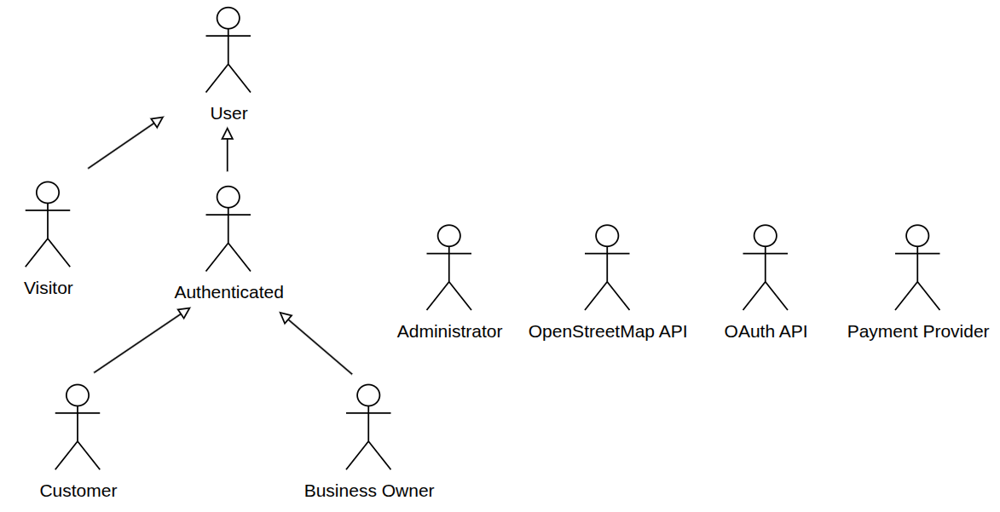
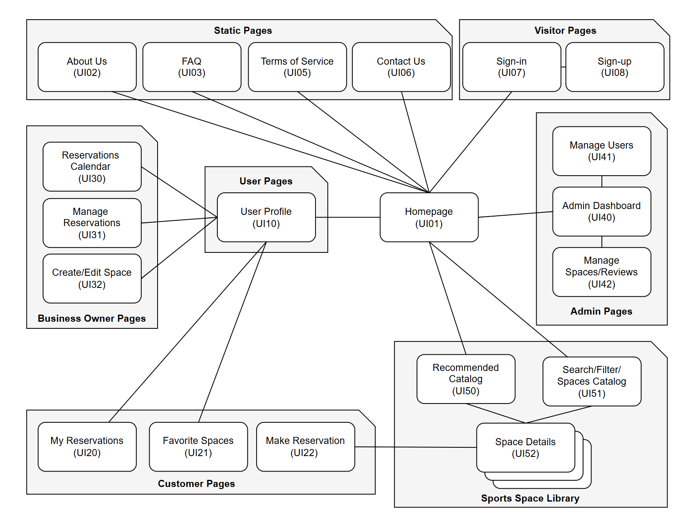
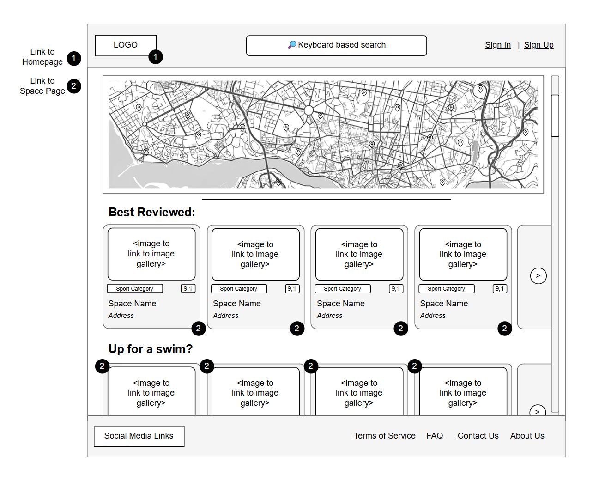
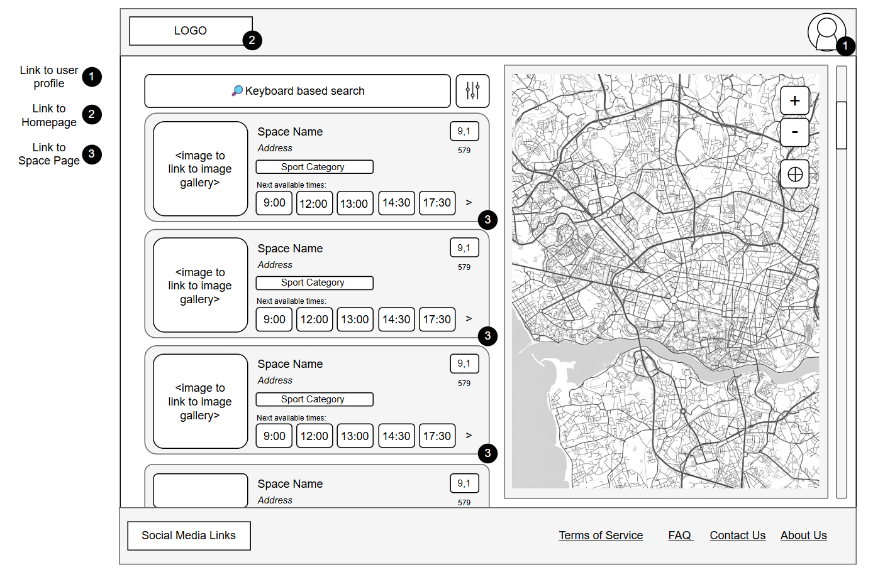
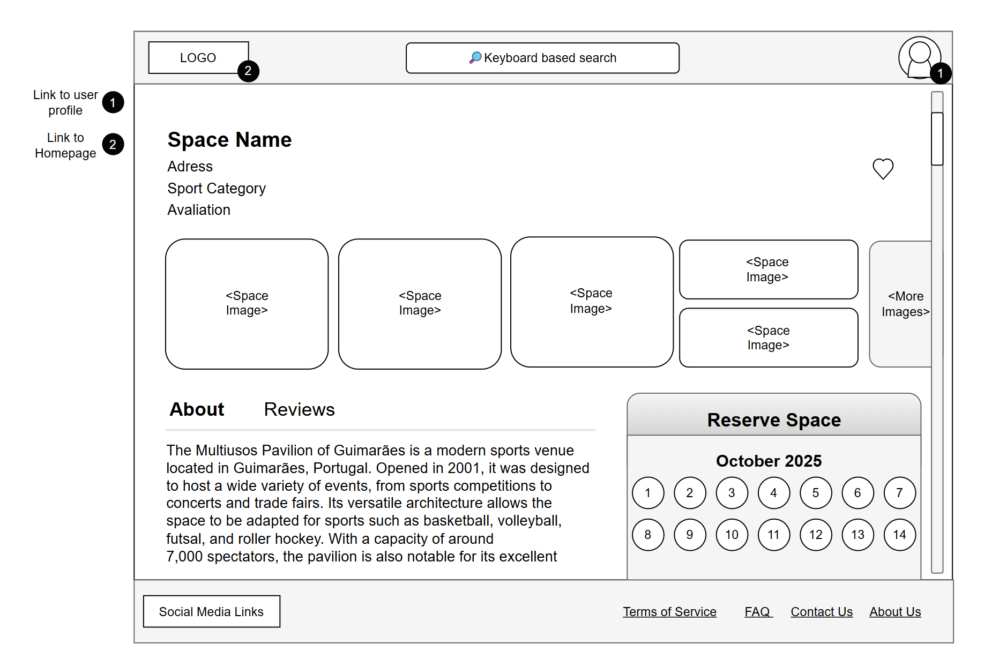
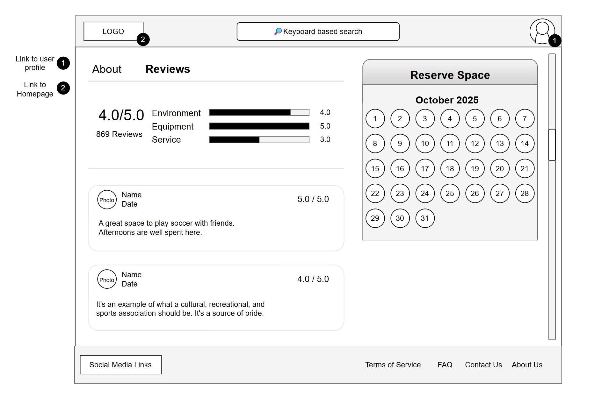
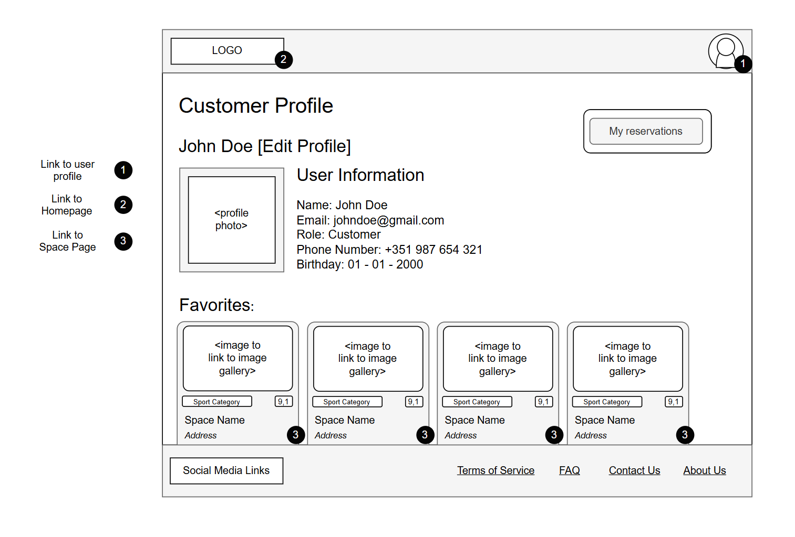
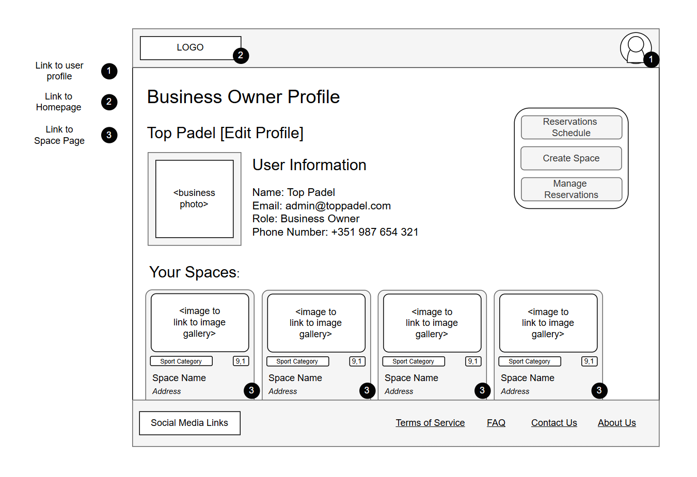

# ER: Requirements Specification Component

The _SportsHub_ system is being developed as a web-based platform that connects people who want flexible sports options with sports facilities and service providers. Unlike traditional long-term membership models, _SportsHub_ allows users to search, book and experience different sports activities anytime, anywhere, without commitments. It bridges the gap between users who want flexibility (such as digital nomads, casual players or people with irregular schedules) and businesses that want to optimize their underused spaces or promote their services in a wider market.

## A1: _SportsHub_

### <u> Goals, business context, environment and motivation </u>

The main goal of _SportsHub_ is to develop a web-based platform that simplifies access to sports activities, allowing people to easily discover, compare, and book sports experiences whenever and wherever they want to practice. The platform is positioned within the sports and fitness industry, competing with traditional booking systems and membership models by offering a unified marketplace for diverse sports activities with a strong focus on on-demand usage and user freedom.

_SportsHub_ addresses the challenges faced by both sides of the sports activity market. For users, current models create barriers such as monthly fees, lack of facility knowledge and difficulty with last-minute bookings. For businesses, the main challenge is underutilization of spaces during off-peak hours and struggles with visibility. _SportsHub_ creates a symbiotic relationship where users gain maximum flexibility and variety while businesses achieve better profitability and exposure.

### <u> Main Features </u>

The platform includes sign-in/sign-up, user registration and profile management, personalized search and filtering capabilities, detailed facility pages with reviews, an instant booking system with multiple payment options, comprehensive notification system, reservation management and a business dashboard for facility owners. The platform features adaptive and responsive design ensuring optimal usability across desktop, tablet, and mobile devices.

### <u> User Profiles </u>

_SportsHub_ serves four main user types: **Visitors** who are unauthenticated users that can search activities, browse the platform and may choose to sign in or sign up; **Customers** (including casual sports players, tourists, and digital nomads) who can search, book spaces and write reviews; **Businesses** (facility owners and providers) who register their spaces, manage availability and pricing, and interact with user feedback and **Administrators** who manage the overall system and ensure smooth operation;

## A2: Actors and User stories

This artifact contains the specification of the actors and their user stories, serving as a basis for the system requirements

### A2.1. Actors

For _SportsHub_ website, the actors are represented in Figure 1 and described in Table 1.

  
  
Figure 1: SportsHub actors

|    Actor    | Description |
|-------------|-------------|
| User | Generic user that can see public information such as sports facilities, prices, availability, reviews… |
| Visitor | Unauthenticated user that can register itself (sign-up) or sign-in in the system |
| Authenticated | Registered users can create, edit and delete their profiles |
| Customer | Authenticated users that can make, edit or cancel reservations and write reviews |
| Business Owner | Authenticated users that can register their spaces, manage availability and pricing and interact with user feedback |
| Administrator | Manages the overall systems and ensures a smooth experience |
| Payment Provider | Allows to make payments through external providers |
| OpenStreetMap API | External API responsible for the system's map service (OpenStreetMap) |

  
Table 1: SportsHub actors description.

### A2.2. User Stories

For the _SportsHub_ website, consider the user stories that are presented in the following sections.

#### A2.2.1. Visitor

| Identifier | Name     | Priority | Responsible | Description                                                                                     |
|------------|----------|----------|-------------|-------------------------------------------------------------------------------------------------|
| US10       | Sign-in  | High     | Gustavo     | As a Visitor, I want to be able to authenticate into the system, so that I can access my profile and my bookings |
| US11       | Sign-up  | High     | Gustavo     | As a Visitor, I want to be able to create an account in the system, so that I can access its main features |

  
Table 2: Visitor user stories.

#### A2.2.2. User

| Identifier | Name                      | Priority | Responsible     | Description                                                                 |
|------------|---------------------------|----------|-----------------|-----------------------------------------------------------------------------|
| US20       | See Home page             | High     | Tiago Oliveira  | As a User, I want to access the home page, so that I can have access to main features and a brief presentation of the website. |
| US21       | See About page            | High     | Tiago Oliveira  | As a User, I want to see the about page, so that I can see a description about the main information of the website. |
| US22       | See Services informations | High     | Tiago Oliveira  | As a User, I want to see the service's information, so I can understand how the website works. |
| US23       | Consult FAQ page          | High     | Tiago Oliveira  | As a User, I want to see the FAQ, so I can get answers to common questions. |
| US24       | Consult Contacts page     | High     | Tiago Oliveira  | As a User, I want to see admin’s contacts, so I can come in touch with the website creators. |
| US25       | Search Activities         | High     | Francisco Gomes | As a User, I want to search for activities, so that I can find those that spark my interest. |
| US26       | Filter Activities         | High     | Francisco Gomes | As a User, I want to filter the results I get, so that I can more freely choose those that better suite me. |
| US27       | See sports’ spaces details | High  | Gustavo         | As a User, I want to see the details of the sports space I select, so that I can plan what to choose. |
| US28       | Viewing profiles          | High     | Gustavo         | As a User, I want to be able to view other’s profiles, so that I can access relevant information. |

  
Table 3: User user stories.

#### A2.2.3. Authenticated User

| Identifier | Name               | Priority | Responsible | Description                                                                 |
|------------|--------------------|----------|-------------|-----------------------------------------------------------------------------|
| US30       | Editing my profile | High     | unknown     | As an Authenticated User, I want to be able to edit my own profile, so that I can update my information |

  
Table 4: Authenticated user user stories.

#### A2.2.4. Customer

| Identifier | Name                                      | Priority | Responsible | Description                                                                 |
|------------|-------------------------------------------|----------|-------------|-----------------------------------------------------------------------------|
| US40       | Book a sport space                        | High     | Gustavo     | As a Customer, I want to be able to book a sport space, so that I can ensure a slot in that space. |
| US41       | Edit my future reservation                | High     | unknown     | As a Customer, I want to be able to edit my future reservations, so that I can keep my reservations up-to-date. |
| US42       | Cancel my future reservation              | High     | Gustavo     | As a Customer, I want to be able to cancel a reservation I made, so that I can free up the space if I am unable to attend. |
| US43       | See my reservations                       |    High      | Gustavo     | As a Customer, I want to be able to see my future or past reservations, so that I can remember and review past reservations and keep me updated or edit my future reservations. |
| US44       | Review a sport space                      | Medium   | unknown     | As a Customer, I want to review a sport space I have attended, so that other users can make informed decisions about the quality of each space. |
| US45       | Getting notifications of a reservation    | Low      | unknown     | As a Customer, I want to receive a notification when a reservation is confirmed, cancelled or is very soon so that I can always stay informed. |
| US46       | Recommendations Algorithm                 | Low      | Tiago Yin     | As a Customer, I want to see spaces based on my preferences, so that I can have a more enjoyable and personalized experience. |

  
Table 5: Customer user stories.

#### A2.2.5. Business Owner

| Identifier | Name                                  | Priority | Responsible | Description                                                                 |
|------------|---------------------------------------|----------|-------------|-----------------------------------------------------------------------------|
| US50       | Creating new sports spaces            | High     | Gustavo     | As a Business Owner, I want to be able to create new sports spaces, so that my clients can interact with my sports space. |
| US51       | Editing sports spaces details         | High     | Tiago Yin     | As a Business Owner, I want to be able to edit the details of my spaces, so that customers always have accurate and detailed information to help them decide and book. |
| US52       | Delete or hide sports spaces          | High     | Gustavo     | As a Business Owner, I want to delete or hide sports spaces, so that customers cannot see or try to book spaces that are no longer available. |
| US53       | Setting sports spaces schedules and capacity | Medium | Tiago Yin | As a Business Owner, I want to set schedules and capacities for my sports spaces, so that my customers know when each spaces are available. |
| US54       | Accepting, declining, modifing or canceling reservations | Medium | unknown | As a Business Owner, I want to be able to accept, decline, modify or cancel customer reservations, so that I can manage my availability efficiently and avoid scheduling conflicts. | 
| US55       | Seeing space's reservations in a calendar | Medium | Tiago Yin   | As a Business Owner, I want to see all reservations for my spaces in a calendar, so that I can easily track bookings and manage better schedules. |
| US56       | Respond to reviews                    | Low      | unknown     | As a Business Owner, I want respond to reviews in my sports spaces, so that I can appreciate for positive comments and provide a response to negative reviews. |
| US57       | Getting notified when a reservation is made | Low | Tiago Yin    | As a Business Owner, I want to be notified whenever a customer makes a reservation, so that I can manage my schedule effectively |
| US58       | Discounts                             | Low      | Tiago Yin     | As a Business Owner, I want to create and manage discounts for my sports spaces, so that I can attract more customers |

  
Table 6: Business Owner user stories.

#### A2.2.6. Admin

| Identifier | Name                                       | Priority | Responsible | Description                                                                 |
|------------|--------------------------------------------|----------|-------------|-----------------------------------------------------------------------------|
| US60       | Manage users accounts   | Medium   | Tiago Yin  | As an Admin, I want to manage user accounts, so that I can maintain control over access, ensure security, and keep the system organized. |
| US61       | Manage sports spaces                       | Medium | Tiago Yin | As an Admin, I want to delete inappropriate sports spaces, so that the platform remains safe and trustworthy for all users. |
| US62       | Deleting inappropriate reviews             | Medium  | Tiago Yin | As an Admin, I want to delete inappropriate comments, so that the platform remains respectful and welcoming for all users. |

  
Table 7: Admin user stories.

### A2.3. Supplementary Requirements

This section contains business rules, technical requirements and other restrictions on the SportsHub's project.

#### A2.3.1. Business rules

| Identifier | Name                      | Description                                                                 |
|------------|---------------------------|-----------------------------------------------------------------------------|
| BR10       | Deleted Account           | Upon account deletion, reviews are kept but are made anonymous.
| BR11       | Administrator Account     | Administrator accounts are independent of the user accounts, i.e. they cannot make reservations or create a sports space.
| BR12       | Reservation details       | A reservation must be associated with a user, sports space and schedule.
| BR13       | Reservation schedule Constraint | Customers cannot double-book in the same (or different) sport spaces at the same time slot.
| BR14       | Valid Reviews             | Customers can only leave a review at sports spaces where they have already been to (booked in the past)
| BR15       | Reservation Dates and hours | Customers cannot book on a past date or past time of the same day. 
| BR16       | Business Owners Accounts Limitation | A business owner cannot make any reservation or review but can see all the sports spaces and other funcionalities.
| BR17       | Modify Reservations       | Customers can cancel or modify reservations only before the reservation start time. |

  
Table 8: SportsHub Business Rules

#### A2.3.2. Technical requirements

| Identifier | Name             | Description                                                                 |
|------------|------------------|-----------------------------------------------------------------------------|
| TR10       | Availability     | The system must be available 99% of the time in each 7 days cycle.              |
| <b>TR11</b>     | <b> Compatibility </b>    | <b> The application must be compatible in different types of systems, such as computers, tablets and smartphones </b> |
| TR12       | Development Tools | The system must be developed using HTML5, CSS, PHP and JavaScript, as well as compatible frameworks |
| <b>TR13</b>       | <b>Usability</b>        | <b>The system must be easy and intuitive to use, as it is designed to be used by every age group without technical experience</b> |
| <b>TR14</b>       | <b>Security</b>         | <b>The system shall protect information from unauthorized access through the use of an authentication system. It should keep all sensitive information such as location and payment details encrypted</b> |
| TR15       | Database         | The PostgreSQL database management system must be used, with a version of 11 or higher. |
| TR16       | Performance      | The system must support at least 60 concurrent reservations per minute.     |

  
Table 9: SportsHub Technical Requirements

#### A2.3.3. Restrictions

| Identifier | Name                   | Description                                                                 |
|------------|------------------------|-----------------------------------------------------------------------------|
| R10        | Discount limit         | Discounts cannot exceed 100%.                                                |
| R11        | Age restrictions       | Minors cannot create an account on the website.                             |
| R12        | Realistic bookings     | Reservations can’t be made more than 1 year in advance                      |
| R13        | Unique account         | There can be only 1 account per email and phone number                      |

  
Table 10: SportsHub Project Restrictions

## A3: Information Architecture

> Brief presentation of the artifact goals.

### A3.1. Sitemap

The image below represents the pages that are going to exist in SportsHub and how they can be accessed or used. It is a simple design of the process of using the website.

  
  
Figure 2: SportsHub sitemap

### A3.2. Wireframes

The wireframes below show the template and localization of the important interactive elements. The home page is the most significant page in our system and because of it it is represented below, the next pages that required some clarification and thinking about its usability are the search page, profiles pages (customer profile / business owner profile) and the sports space page. As such they also have wireframes.

#### UI01: Home Page

  
  
Figure 3: Home page wireframe

#### UI51: Search Page

  
  
Figure 4: Search page wireframe

#### UI52: Sports Space Details Page

  
  
  
Figure 7: Sports space details page wireframe

#### UI10: Profiles Pages

  
  
Figure 5: Customer profile page wireframe

  
  
Figure 6: Business owner profile page wireframe

## Revision history

Changes made to the first submission:

(nothing to mention)

GROUP25122, 27/09/2025

* Group member 1 Gustavo Lourenço up202306578@up.pt
* Group member 2 Tiago Oliveira, up202007448@up.pt
* Group member 3 Tiago Yin, up202306438@up.pt
* Group member 4 Francisco Gomes, up20306498@up.pt